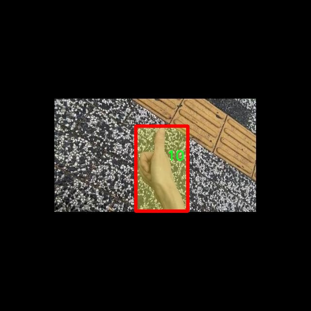
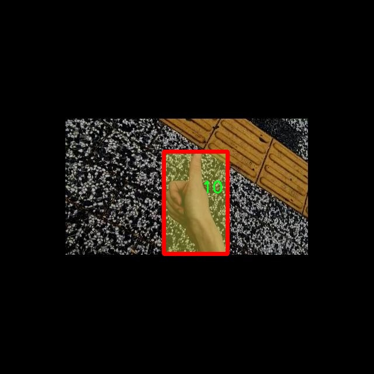

# 手势识别分割系统源码＆数据集分享
 [yolov8-seg-C2f-SCcConv＆yolov8-seg-KernelWarehouse等50+全套改进创新点发刊_一键训练教程_Web前端展示]

### 1.研究背景与意义

项目参考[ILSVRC ImageNet Large Scale Visual Recognition Challenge](https://gitee.com/YOLOv8_YOLOv11_Segmentation_Studio/projects)

项目来源[AAAI Global Al lnnovation Contest](https://kdocs.cn/l/cszuIiCKVNis)

研究背景与意义

随着人机交互技术的快速发展，手势识别作为一种自然、直观的交互方式，逐渐引起了广泛的关注。手势识别不仅在智能家居、虚拟现实、增强现实等领域展现出巨大的应用潜力，还在医疗、教育、安防等行业中发挥着重要作用。传统的手势识别方法多依赖于手工特征提取和简单的分类器，往往面临着环境光照变化、手势多样性及背景复杂性等挑战。因此，基于深度学习的手势识别技术逐渐成为研究的热点，其中YOLO（You Only Look Once）系列模型因其高效的实时检测能力而备受青睐。

YOLOv8作为YOLO系列的最新版本，在目标检测和实例分割任务中表现出色，具备了更高的准确性和更快的推理速度。然而，现有的YOLOv8模型在手势识别领域的应用仍存在一定的局限性，尤其是在复杂背景下的手势分割和识别。因此，基于改进YOLOv8的手势识别分割系统的研究具有重要的理论价值和实际意义。

本研究将以一个包含3700张图像和10个类别的手势数据集为基础，探讨如何通过改进YOLOv8模型，提升手势识别的准确性和鲁棒性。该数据集涵盖了多种手势类型，包括数字手势和其他常见手势，能够为模型的训练和评估提供丰富的样本。通过对数据集的深入分析，我们将识别出影响手势识别性能的关键因素，并在此基础上提出相应的改进策略。

在技术层面，本研究将通过引入数据增强、特征融合和多尺度检测等技术手段，优化YOLOv8模型的结构，以适应手势识别的特定需求。数据增强技术将有效提升模型的泛化能力，特征融合将增强模型对不同手势特征的学习能力，而多尺度检测则有助于提高模型对不同大小手势的识别精度。这些改进将使得手势识别系统在实际应用中更加高效、准确。

此外，本研究的成果将为相关领域的研究提供重要的参考价值。通过建立一个高效的手势识别分割系统，我们不仅能够推动手势识别技术的发展，还能够为智能交互系统的设计与实现提供新的思路。未来，随着智能设备的普及和人工智能技术的不断进步，手势识别将在更多的应用场景中发挥重要作用。因此，深入研究基于改进YOLOv8的手势识别分割系统，具有重要的学术意义和广泛的应用前景。

综上所述，基于改进YOLOv8的手势识别分割系统的研究，不仅有助于提升手势识别技术的性能，还将推动人机交互领域的进一步发展。通过对手势识别的深入探索，我们期待能够为未来的智能交互技术奠定坚实的基础。

### 2.图片演示


##### 注意：由于此博客编辑较早，上面“2.图片演示”和“3.视频演示”展示的系统图片或者视频可能为老版本，新版本在老版本的基础上升级如下：（实际效果以升级的新版本为准）

  （1）适配了YOLOV8的“目标检测”模型和“实例分割”模型，通过加载相应的权重（.pt）文件即可自适应加载模型。

  （2）支持“图片识别”、“视频识别”、“摄像头实时识别”三种识别模式。

  （3）支持“图片识别”、“视频识别”、“摄像头实时识别”三种识别结果保存导出，解决手动导出（容易卡顿出现爆内存）存在的问题，识别完自动保存结果并导出到tempDir中。

  （4）支持Web前端系统中的标题、背景图等自定义修改，后面提供修改教程。

  另外本项目提供训练的数据集和训练教程,暂不提供权重文件（best.pt）,需要您按照教程进行训练后实现图片演示和Web前端界面演示的效果。

### 3.视频演示

[3.1 视频演示](https://www.bilibili.com/video/BV1DL2HYNE1r/)

### 4.数据集信息展示

##### 4.1 本项目数据集详细数据（类别数＆类别名）

nc: 10
names: ['1', '10', '2', '3', '4', '5', '6', '7', '8', '9']


##### 4.2 本项目数据集信息介绍

数据集信息展示

在本研究中，我们使用了名为“hand_sign”的数据集，以训练和改进YOLOv8-seg手势识别分割系统。该数据集专门设计用于手势识别任务，涵盖了十种不同的手势类别，旨在为计算机视觉领域的手势识别提供丰富的样本和标注信息。数据集的类别数量为10，具体类别包括：‘1’, ‘10’, ‘2’, ‘3’, ‘4’, ‘5’, ‘6’, ‘7’, ‘8’, ‘9’。这些类别不仅代表了不同的手势符号，也体现了手势在实际应用中的多样性和复杂性。

“hand_sign”数据集的构建过程经过精心设计，确保了数据的多样性和代表性。每个类别的手势样本均经过专业人员的标注，确保了数据的准确性和一致性。数据集中包含了不同角度、不同光照条件下的手势图像，极大地增强了模型的鲁棒性和泛化能力。这种多样化的样本选择，使得训练出的YOLOv8-seg模型能够在各种现实场景中有效识别和分割手势。

在数据集的具体构成上，类别‘1’至‘10’分别对应于不同的手势，每个手势的图像数量均衡，确保了模型在训练过程中不会偏向某一特定类别。这样的设计使得模型能够全面学习到各类手势的特征，从而提高识别的准确性和效率。此外，数据集中还包含了手势的分割标注信息，这为YOLOv8-seg模型的训练提供了必要的监督信号，使得模型不仅能够识别手势的类别，还能够精确地分割出手势在图像中的位置。

为了进一步提高模型的性能，我们在数据预处理阶段采用了一系列增强技术，包括随机裁剪、旋转、翻转和颜色调整等。这些增强方法不仅增加了数据集的有效样本数量，还帮助模型更好地适应不同的手势表现形式。通过这些手段，我们期望能够提升YOLOv8-seg在实际应用中的表现，使其在复杂环境下依然能够保持高效的手势识别能力。

在训练过程中，我们将“hand_sign”数据集分为训练集和验证集，以便对模型的性能进行有效评估。训练集用于模型的学习，而验证集则用于监测模型在未见数据上的表现，确保模型的泛化能力。通过不断迭代和优化，我们期望最终得到一个能够在实时手势识别任务中表现优异的系统。

总之，“hand_sign”数据集为本研究提供了坚实的基础，通过其丰富的手势样本和精确的标注信息，我们能够有效地训练和改进YOLOv8-seg手势识别分割系统。这一数据集不仅为手势识别领域的研究提供了重要的参考，也为实际应用中的人机交互提供了新的可能性。随着技术的不断进步，我们相信这一领域将会迎来更多的创新和突破。






### 5.全套项目环境部署视频教程（零基础手把手教学）

[5.1 环境部署教程链接（零基础手把手教学）](https://www.bilibili.com/video/BV1jG4Ve4E9t/?vd_source=bc9aec86d164b67a7004b996143742dc)


[5.2 安装Python虚拟环境创建和依赖库安装视频教程链接（零基础手把手教学）](https://www.bilibili.com/video/BV1nA4VeYEze/?vd_source=bc9aec86d164b67a7004b996143742dc)

### 6.手把手YOLOV8-seg训练视频教程（零基础小白有手就能学会）

[6.1 手把手YOLOV8-seg训练视频教程（零基础小白有手就能学会）](https://www.bilibili.com/video/BV1cA4VeYETe/?vd_source=bc9aec86d164b67a7004b996143742dc)


按照上面的训练视频教程链接加载项目提供的数据集，运行train.py即可开始训练



     Epoch   gpu_mem       box       obj       cls    labels  img_size
     1/200     0G   0.01576   0.01955  0.007536        22      1280: 100%|██████████| 849/849 [14:42<00:00,  1.04s/it]
               Class     Images     Labels          P          R     mAP@.5 mAP@.5:.95: 100%|██████████| 213/213 [01:14<00:00,  2.87it/s]
                 all       3395      17314      0.994      0.957      0.0957      0.0843

     Epoch   gpu_mem       box       obj       cls    labels  img_size
     2/200     0G   0.01578   0.01923  0.007006        22      1280: 100%|██████████| 849/849 [14:44<00:00,  1.04s/it]
               Class     Images     Labels          P          R     mAP@.5 mAP@.5:.95: 100%|██████████| 213/213 [01:12<00:00,  2.95it/s]
                 all       3395      17314      0.996      0.956      0.0957      0.0845

     Epoch   gpu_mem       box       obj       cls    labels  img_size
     3/200     0G   0.01561    0.0191  0.006895        27      1280: 100%|██████████| 849/849 [10:56<00:00,  1.29it/s]
               Class     Images     Labels          P          R     mAP@.5 mAP@.5:.95: 100%|███████   | 187/213 [00:52<00:00,  4.04it/s]
                 all       3395      17314      0.996      0.957      0.0957      0.0845


### 7.50+种全套YOLOV8-seg创新点代码加载调参视频教程（一键加载写好的改进模型的配置文件）

[7.1 50+种全套YOLOV8-seg创新点代码加载调参视频教程（一键加载写好的改进模型的配置文件）](https://www.bilibili.com/video/BV1Hw4VePEXv/?vd_source=bc9aec86d164b67a7004b996143742dc)

### 8.YOLOV8-seg图像分割算法原理

原始YOLOv8-seg算法原理

YOLOv8-seg算法是YOLO系列的最新发展，继承了YOLOv3和YOLOv5的设计理念，并在此基础上进行了多项重要改进。该算法不仅专注于目标检测，还扩展到了图像分割任务，标志着YOLO系列在计算机视觉领域的进一步深化。YOLOv8-seg通过引入先进的网络结构和优化策略，提升了检测精度和速度，成为当前流行的实时目标检测与分割算法之一。

YOLOv8-seg的网络结构可以分为四个主要部分：输入端、骨干网络、颈部网络和头部网络。输入端负责数据的预处理，包括马赛克增强、自适应锚框计算和自适应灰度填充等。这些预处理步骤不仅增强了模型的鲁棒性，还提高了其对不同场景的适应能力。马赛克增强通过将多张图像拼接在一起，增加了训练样本的多样性，而自适应锚框计算则使得模型能够根据输入数据动态调整锚框的大小和数量，从而更好地适应不同物体的尺度。

在骨干网络部分，YOLOv8-seg采用了C2f模块，这一模块相较于YOLOv5中的C3模块，具有更丰富的梯度流和特征表示能力。C2f模块通过增加分支连接，增强了特征学习的深度和广度，使得网络能够提取更为复杂的特征信息。此外，YOLOv8-seg还引入了空间金字塔池化融合（SPPF）结构，进一步提升了多尺度特征的融合能力。这种设计使得模型在处理不同尺寸的目标时，能够更有效地整合来自不同层次的特征信息。

颈部网络部分则采用了路径聚合网络（PAN）结构，旨在增强不同尺度对象的特征融合能力。PAN通过将低层特征与高层特征进行有效结合，确保了模型在分割任务中对细节信息的捕捉。这一设计使得YOLOv8-seg在处理复杂场景时，能够保持高精度的分割效果。

头部网络是YOLOv8-seg的关键组成部分，它将分类和检测过程进行了解耦，分别处理目标的分类和定位任务。与传统的耦合头结构不同，YOLOv8-seg采用了解耦头结构，通过两条并行的分支分别提取类别特征和位置特征。这种设计不仅提高了模型的灵活性，还加速了非最大抑制（NMS）过程，从而提升了整体检测效率。

在标签分配策略方面，YOLOv8-seg采用了动态标签分配策略，解决了正负样本匹配的问题。该策略通过对目标框和目标分数的动态调整，确保了模型在训练过程中能够有效学习到不同类别的特征。YOLOv8-seg的损失计算涵盖了分类和回归两个分支，其中分类分支使用了变焦损失（Varifocal Loss），而回归分支则结合了CIoULoss和DFLoss。这种多样化的损失计算方式，能够有效提升模型对边界框预测的精准性。

值得注意的是，YOLOv8-seg在设计上考虑到了轻量化的需求，特别是YOLOv8n版本，其参数量最小且检测速度最快。通过对骨干特征提取网络层进行优化，YOLOv8n使用了更轻量化的C2f模块，并在特征融合层减少了降采样层的数量，从而提高了模型的计算效率。这一系列的优化措施，使得YOLOv8-seg在保持高精度的同时，能够在资源受限的环境中实现实时检测与分割。

总的来说，YOLOv8-seg算法通过引入新的网络结构、优化策略和动态标签分配机制，显著提升了目标检测与分割的性能。其在各个环节的设计都体现了对实时性和精度的双重追求，使得YOLOv8-seg成为当前计算机视觉领域中一款具有广泛应用前景的算法。无论是在自动驾驶、安防监控还是医疗影像分析等领域，YOLOv8-seg都展现出了强大的能力，推动了智能视觉技术的不断进步。


### 9.系统功能展示（检测对象为举例，实际内容以本项目数据集为准）

图9.1.系统支持检测结果表格显示

  图9.2.系统支持置信度和IOU阈值手动调节

  图9.3.系统支持自定义加载权重文件best.pt(需要你通过步骤5中训练获得)

  图9.4.系统支持摄像头实时识别

  图9.5.系统支持图片识别

  图9.6.系统支持视频识别

  图9.7.系统支持识别结果文件自动保存

  图9.8.系统支持Excel导出检测结果数据


### 10.50+种全套YOLOV8-seg创新点原理讲解（非科班也可以轻松写刊发刊，V11版本正在科研待更新）

#### 10.1 由于篇幅限制，每个创新点的具体原理讲解就不一一展开，具体见下列网址中的创新点对应子项目的技术原理博客网址【Blog】：


[10.1 50+种全套YOLOV8-seg创新点原理讲解链接](https://gitee.com/qunmasj/good)

#### 10.2 部分改进模块原理讲解(完整的改进原理见上图和技术博客链接)【此小节的图要是加载失败请移步原始博客查看，链接：https://blog.csdn.net/cheng2333333?type=blog】

### Gold-YOLO


#### Preliminaries
YOLO系列的中间层结构采用了传统的FPN结构，其中包含多个分支用于多尺度特征融合。然而，它只充分融合来自相邻级别的特征，对于其他层次的信息只能间接地进行“递归”获取。

传统的FPN结构在信息传输过程中存在丢失大量信息的问题。这是因为层之间的信息交互仅限于中间层选择的信息，未被选择的信息在传输过程中被丢弃。这种情况导致某个Level的信息只能充分辅助相邻层，而对其他全局层的帮助较弱。因此，整体上信息融合的有效性可能受到限制。
为了避免在传输过程中丢失信息，本文采用了一种新颖的“聚集和分发”机制（GD），放弃了原始的递归方法。该机制使用一个统一的模块来收集和融合所有Level的信息，并将其分发到不同的Level。通过这种方式，作者不仅避免了传统FPN结构固有的信息丢失问题，还增强了中间层的部分信息融合能力，而且并没有显著增加延迟。


#### 低阶聚合和分发分支 Low-stage gather-and-distribute branch
从主干网络中选择输出的B2、B3、B4、B5特征进行融合，以获取保留小目标信息的高分辨率特征。


#### 高阶聚合和分发分支 High-stage gather-and-distribute branch
高级全局特征对齐模块（High-GD）将由低级全局特征对齐模块（Low-GD）生成的特征{P3, P4, P5}进行融合。


Transformer融合模块由多个堆叠的transformer组成，transformer块的数量为L。每个transformer块包括一个多头注意力块、一个前馈网络（FFN）和残差连接。采用与LeViT相同的设置来配置多头注意力块，使用16个通道作为键K和查询Q的头维度，32个通道作为值V的头维度。为了加速推理过程，将层归一化操作替换为批归一化，并将所有的GELU激活函数替换为ReLU。为了增强变换器块的局部连接，在两个1x1卷积层之间添加了一个深度卷积层。同时，将FFN的扩展因子设置为2，以在速度和计算成本之间取得平衡。


信息注入模块(Information injection module)： 高级全局特征对齐模块（High-GD）中的信息注入模块与低级全局特征对齐模块（Low-GD）中的相同。在高级阶段，局部特征（Flocal）等于Pi，因此公式如下所示：


#### 增强的跨层信息流动 Enhanced cross-layer information flow
为了进一步提升性能，从YOLOv6 中的PAFPN模块中得到启发，引入了Inject-LAF模块。该模块是注入模块的增强版，包括了一个轻量级相邻层融合（LAF）模块，该模块被添加到注入模块的输入位置。为了在速度和准确性之间取得平衡，设计了两个LAF模型：LAF低级模型和LAF高级模型，分别用于低级注入（合并相邻两层的特征）和高级注入（合并相邻一层的特征）。它们的结构如图5(b)所示。为了确保来自不同层级的特征图与目标大小对齐，在实现中的两个LAF模型仅使用了三个操作符：双线性插值（上采样过小的特征）、平均池化（下采样过大的特征）和1x1卷积（调整与目标通道不同的特征）。模型中的LAF模块与信息注入模块的结合有效地平衡了准确性和速度之间的关系。通过使用简化的操作，能够增加不同层级之间的信息流路径数量，从而提高性能而不显著增加延迟。


### 11.项目核心源码讲解（再也不用担心看不懂代码逻辑）

#### 11.1 ultralytics\utils\callbacks\hub.py

以下是对代码的核心部分进行提炼和详细注释的结果：

```python
# 导入必要的库
import json
from time import time
from ultralytics.hub.utils import HUB_WEB_ROOT, PREFIX, events
from ultralytics.utils import LOGGER, SETTINGS

def on_pretrain_routine_end(trainer):
    """在预训练例程结束时记录信息，并开始上传速率限制的计时器。"""
    session = getattr(trainer, 'hub_session', None)  # 获取训练器的会话对象
    if session:
        # 记录模型的访问链接
        LOGGER.info(f'{PREFIX}View model at {HUB_WEB_ROOT}/models/{session.model_id} 🚀')
        # 初始化计时器以控制上传速率
        session.timers = {'metrics': time(), 'ckpt': time()}

def on_fit_epoch_end(trainer):
    """在每个训练周期结束时上传训练进度指标。"""
    session = getattr(trainer, 'hub_session', None)  # 获取训练器的会话对象
    if session:
        # 收集训练损失和指标
        all_plots = {**trainer.label_loss_items(trainer.tloss, prefix='train'), **trainer.metrics}
        if trainer.epoch == 0:
            from ultralytics.utils.torch_utils import model_info_for_loggers
            all_plots = {**all_plots, **model_info_for_loggers(trainer)}  # 记录模型信息
        session.metrics_queue[trainer.epoch] = json.dumps(all_plots)  # 将指标序列化并存入队列
        # 检查是否超过上传速率限制
        if time() - session.timers['metrics'] > session.rate_limits['metrics']:
            session.upload_metrics()  # 上传指标
            session.timers['metrics'] = time()  # 重置计时器
            session.metrics_queue = {}  # 清空指标队列

def on_model_save(trainer):
    """以速率限制的方式将检查点保存到Ultralytics HUB。"""
    session = getattr(trainer, 'hub_session', None)  # 获取训练器的会话对象
    if session:
        is_best = trainer.best_fitness == trainer.fitness  # 判断当前模型是否是最佳模型
        # 检查是否超过上传速率限制
        if time() - session.timers['ckpt'] > session.rate_limits['ckpt']:
            LOGGER.info(f'{PREFIX}Uploading checkpoint {HUB_WEB_ROOT}/models/{session.model_id}')  # 记录上传信息
            session.upload_model(trainer.epoch, trainer.last, is_best)  # 上传模型
            session.timers['ckpt'] = time()  # 重置计时器

def on_train_end(trainer):
    """在训练结束时上传最终模型和指标到Ultralytics HUB。"""
    session = getattr(trainer, 'hub_session', None)  # 获取训练器的会话对象
    if session:
        LOGGER.info(f'{PREFIX}Syncing final model...')  # 记录同步信息
        # 上传最终模型和指标
        session.upload_model(trainer.epoch, trainer.best, map=trainer.metrics.get('metrics/mAP50-95(B)', 0), final=True)
        session.alive = False  # 停止心跳
        LOGGER.info(f'{PREFIX}Done ✅\n'
                    f'{PREFIX}View model at {HUB_WEB_ROOT}/models/{session.model_id} 🚀')  # 记录完成信息

# 定义回调函数字典，根据设置决定是否启用
callbacks = {
    'on_pretrain_routine_end': on_pretrain_routine_end,
    'on_fit_epoch_end': on_fit_epoch_end,
    'on_model_save': on_model_save,
    'on_train_end': on_train_end,
    'on_train_start': on_train_start,
    'on_val_start': on_val_start,
    'on_predict_start': on_predict_start,
    'on_export_start': on_export_start
} if SETTINGS['hub'] is True else {}  # 检查是否启用hub功能
```

### 代码分析与注释
1. **导入部分**：导入了必要的库和模块，主要用于日志记录、时间管理和Ultralytics HUB的功能。
  
2. **回调函数**：
   - `on_pretrain_routine_end`：在预训练结束时记录模型的访问链接，并初始化上传速率限制的计时器。
   - `on_fit_epoch_end`：在每个训练周期结束时，收集并上传训练指标，确保遵循上传速率限制。
   - `on_model_save`：在训练过程中保存模型检查点，并根据速率限制进行上传。
   - `on_train_end`：在训练结束时上传最终模型和指标，并停止会话的心跳。

3. **回调字典**：根据设置决定是否启用相应的回调函数，确保代码的灵活性和可配置性。

这些核心部分和注释能够帮助理解代码的主要功能和逻辑。

这个文件是Ultralytics YOLO项目中的一个回调函数模块，主要用于在训练过程中与Ultralytics HUB进行交互，上传模型和训练进度的相关信息。代码中定义了一系列的回调函数，这些函数在不同的训练阶段被调用，以便记录和上传训练的状态和结果。

首先，文件导入了一些必要的库和模块，包括`json`用于处理JSON数据，`time`用于时间管理，以及一些来自Ultralytics的工具和设置。接着，定义了一些回调函数，每个函数都有特定的功能。

`on_pretrain_routine_end`函数在预训练例程结束时被调用，主要用于记录信息并启动上传速率限制的计时器。如果训练器对象中存在`hub_session`，则会记录当前模型的链接，并初始化计时器。

`on_fit_epoch_end`函数在每个训练周期结束时被调用，负责上传训练进度的指标。在每个周期结束时，它会收集训练损失和其他指标，并将这些信息以JSON格式存入会话的指标队列中。如果时间超过了上传速率限制，则会调用上传函数，并重置计时器和队列。

`on_model_save`函数在模型保存时被调用，主要用于将检查点上传到Ultralytics HUB，并同样遵循速率限制。如果当前模型是最佳模型，则会标记这一点，并在满足条件时上传模型。

`on_train_end`函数在训练结束时被调用，负责上传最终模型和相关指标到Ultralytics HUB。它会记录同步信息，并在上传完成后停止心跳信号，表示训练过程的结束。

`on_train_start`、`on_val_start`、`on_predict_start`和`on_export_start`函数分别在训练、验证、预测和导出开始时被调用，主要用于执行与这些事件相关的操作。

最后，所有的回调函数被组织成一个字典`callbacks`，该字典的键是事件名称，值是对应的回调函数。如果设置中启用了hub功能，则这些回调函数会被注册以供使用。

总体而言，这个文件的主要功能是通过回调机制与Ultralytics HUB进行交互，记录和上传训练过程中的各种信息，以便于后续的模型管理和分析。

#### 11.2 ui.py

```python
import sys
import subprocess

def run_script(script_path):
    """
    使用当前 Python 环境运行指定的脚本。

    Args:
        script_path (str): 要运行的脚本路径

    Returns:
        None
    """
    # 获取当前 Python 解释器的路径
    python_path = sys.executable

    # 构建运行命令
    command = f'"{python_path}" -m streamlit run "{script_path}"'

    # 执行命令
    result = subprocess.run(command, shell=True)
    if result.returncode != 0:
        print("脚本运行出错。")


# 实例化并运行应用
if __name__ == "__main__":
    # 指定您的脚本路径
    script_path = "web.py"  # 这里可以直接指定脚本路径

    # 运行脚本
    run_script(script_path)
```

### 代码核心部分及详细注释：

1. **导入必要的模块**：
   - `sys`: 用于访问与 Python 解释器相关的变量和函数。
   - `subprocess`: 用于创建新进程、连接到它们的输入/输出/错误管道，并获取返回码。

2. **定义 `run_script` 函数**：
   - 该函数接受一个参数 `script_path`，表示要运行的 Python 脚本的路径。
   - 使用 `sys.executable` 获取当前 Python 解释器的路径，以确保脚本在正确的环境中运行。
   - 构建一个命令字符串，使用 `streamlit` 模块运行指定的脚本。
   - 使用 `subprocess.run` 执行构建的命令，并检查返回码以判断脚本是否成功运行。

3. **主程序块**：
   - 使用 `if __name__ == "__main__":` 确保只有在直接运行该脚本时才会执行以下代码。
   - 指定要运行的脚本路径（这里是 `"web.py"`）。
   - 调用 `run_script` 函数，传入脚本路径以执行该脚本。

这个程序文件名为 `ui.py`，主要功能是使用当前的 Python 环境来运行一个指定的脚本，具体是通过 Streamlit 框架来启动一个 Web 应用。

程序首先导入了必要的模块，包括 `sys`、`os` 和 `subprocess`，这些模块分别用于获取系统信息、处理文件路径和执行外部命令。此外，还导入了 `abs_path` 函数，这个函数来自 `QtFusion.path` 模块，主要用于获取文件的绝对路径。

在 `run_script` 函数中，首先获取当前 Python 解释器的路径，存储在 `python_path` 变量中。接着，构建一个命令字符串，使用 `streamlit run` 命令来运行指定的脚本。这个命令将 Python 解释器的路径和脚本路径结合起来，形成一个完整的命令。

然后，使用 `subprocess.run` 方法来执行这个命令。该方法的 `shell=True` 参数允许在 shell 中执行命令。执行后，程序会检查命令的返回码，如果返回码不为零，表示脚本运行出错，程序会打印出错误信息。

在文件的最后部分，使用 `if __name__ == "__main__":` 来确保只有在直接运行该脚本时才会执行以下代码。这里指定了要运行的脚本路径为 `web.py`，并调用 `run_script` 函数来启动这个脚本。

总体来说，这个程序的主要作用是方便地启动一个基于 Streamlit 的 Web 应用，通过指定脚本路径来实现动态运行。

#### 11.3 ultralytics\cfg\__init__.py

以下是代码中最核心的部分，并附上详细的中文注释：

```python
def cfg2dict(cfg):
    """
    将配置对象转换为字典，无论它是文件路径、字符串还是SimpleNamespace对象。

    参数:
        cfg (str | Path | dict | SimpleNamespace): 要转换为字典的配置对象。

    返回:
        cfg (dict): 转换后的字典格式的配置对象。
    """
    if isinstance(cfg, (str, Path)):
        cfg = yaml_load(cfg)  # 从文件加载字典
    elif isinstance(cfg, SimpleNamespace):
        cfg = vars(cfg)  # 将SimpleNamespace转换为字典
    return cfg


def get_cfg(cfg: Union[str, Path, Dict, SimpleNamespace] = DEFAULT_CFG_DICT, overrides: Dict = None):
    """
    从文件或字典加载并合并配置数据。

    参数:
        cfg (str | Path | Dict | SimpleNamespace): 配置数据。
        overrides (str | Dict | optional): 覆盖配置的文件名或字典。默认为None。

    返回:
        (SimpleNamespace): 训练参数的命名空间。
    """
    cfg = cfg2dict(cfg)

    # 合并覆盖
    if overrides:
        overrides = cfg2dict(overrides)
        if 'save_dir' not in cfg:
            overrides.pop('save_dir', None)  # 忽略特殊覆盖键
        check_dict_alignment(cfg, overrides)
        cfg = {**cfg, **overrides}  # 合并cfg和覆盖字典（优先使用覆盖）

    # 特殊处理数字项目/名称
    for k in 'project', 'name':
        if k in cfg and isinstance(cfg[k], (int, float)):
            cfg[k] = str(cfg[k])
    if cfg.get('name') == 'model':  # 将模型赋值给'name'参数
        cfg['name'] = cfg.get('model', '').split('.')[0]
        LOGGER.warning(f"WARNING ⚠️ 'name=model' 自动更新为 'name={cfg['name']}'.")

    # 类型和值检查
    for k, v in cfg.items():
        if v is not None:  # None值可能来自可选参数
            if k in CFG_FLOAT_KEYS and not isinstance(v, (int, float)):
                raise TypeError(f"'{k}={v}' 的类型 {type(v).__name__} 无效. "
                                f"有效的 '{k}' 类型是 int（例如 '{k}=0'）或 float（例如 '{k}=0.5'）")
            elif k in CFG_FRACTION_KEYS:
                if not isinstance(v, (int, float)):
                    raise TypeError(f"'{k}={v}' 的类型 {type(v).__name__} 无效. "
                                    f"有效的 '{k}' 类型是 int（例如 '{k}=0'）或 float（例如 '{k}=0.5'）")
                if not (0.0 <= v <= 1.0):
                    raise ValueError(f"'{k}={v}' 的值无效. "
                                     f"有效的 '{k}' 值在 0.0 和 1.0 之间。")
            elif k in CFG_INT_KEYS and not isinstance(v, int):
                raise TypeError(f"'{k}={v}' 的类型 {type(v).__name__} 无效. "
                                f"'{k}' 必须是 int（例如 '{k}=8'）")
            elif k in CFG_BOOL_KEYS and not isinstance(v, bool):
                raise TypeError(f"'{k}={v}' 的类型 {type(v).__name__} 无效. "
                                f"'{k}' 必须是 bool（例如 '{k}=True' 或 '{k}=False'）")

    # 返回实例
    return IterableSimpleNamespace(**cfg)


def entrypoint(debug=''):
    """
    该函数是ultralytics包的入口点，负责解析传递给包的命令行参数。

    该函数允许：
    - 以字符串列表的形式传递必需的YOLO参数
    - 指定要执行的任务，可以是'detect'、'segment'或'classify'
    - 指定模式，可以是'train'、'val'、'test'或'predict'
    - 运行特殊模式，如'checks'
    - 向包的配置传递覆盖

    它使用包的默认配置并使用传递的覆盖进行初始化。
    然后调用带有组合配置的CLI函数。
    """
    args = (debug.split(' ') if debug else sys.argv)[1:]
    if not args:  # 没有传递参数
        LOGGER.info(CLI_HELP_MSG)
        return

    # 处理特殊命令
    special = {
        'help': lambda: LOGGER.info(CLI_HELP_MSG),
        'checks': checks.collect_system_info,
        'version': lambda: LOGGER.info(__version__),
        'settings': lambda: handle_yolo_settings(args[1:]),
        'cfg': lambda: yaml_print(DEFAULT_CFG_PATH),
        'hub': lambda: handle_yolo_hub(args[1:]),
        'login': lambda: handle_yolo_hub(args),
        'copy-cfg': copy_default_cfg}
    
    # 定义常见的特殊命令误用
    special.update({k[0]: v for k, v in special.items()})  # 单数
    special.update({k[:-1]: v for k, v in special.items() if len(k) > 1 and k.endswith('s')})  # 单数
    special = {**special, **{f'-{k}': v for k, v in special.items()}, **{f'--{k}': v for k, v in special.items()}}

    overrides = {}  # 基本覆盖，例如 imgsz=320
    for a in merge_equals_args(args):  # 合并'='周围的空格
        if '=' in a:
            try:
                k, v = parse_key_value_pair(a)
                overrides[k] = v
            except (NameError, SyntaxError, ValueError, AssertionError) as e:
                check_dict_alignment(full_args_dict, {a: ''}, e)

        elif a in TASKS:
            overrides['task'] = a
        elif a in MODES:
            overrides['mode'] = a
        elif a.lower() in special:
            special[a.lower()]()
            return
        elif a in DEFAULT_CFG_DICT and isinstance(DEFAULT_CFG_DICT[a], bool):
            overrides[a] = True  # 默认布尔参数自动设置为True
        elif a in DEFAULT_CFG_DICT:
            raise SyntaxError(f"'{colorstr('red', 'bold', a)}' 是有效的YOLO参数，但缺少'='符号来设置其值，"
                              f"例如尝试 '{a}={DEFAULT_CFG_DICT[a]}'\n{CLI_HELP_MSG}")
        else:
            check_dict_alignment(full_args_dict, {a: ''})

    # 检查键
    check_dict_alignment(full_args_dict, overrides)

    # 模式
    mode = overrides.get('mode')
    if mode is None:
        mode = DEFAULT_CFG.mode or 'predict'
        LOGGER.warning(f"WARNING ⚠️ 'mode' 缺失. 有效模式为 {MODES}. 使用默认 'mode={mode}'.")

    # 任务
    task = overrides.pop('task', None)
    if task:
        if task not in TASKS:
            raise ValueError(f"无效的 'task={task}'. 有效任务为 {TASKS}.")

    # 模型
    model = overrides.pop('model', DEFAULT_CFG.model)
    if model is None:
        model = 'yolov8n.pt'
        LOGGER.warning(f"WARNING ⚠️ 'model' 缺失. 使用默认 'model={model}'.")

    # 运行命令
    getattr(model, mode)(**overrides)  # 使用模型的默认参数

    # 显示帮助
    LOGGER.info(f'💡 了解更多信息请访问 https://docs.ultralytics.com/modes/{mode}')
```

以上代码片段保留了核心功能，包括配置处理、命令行参数解析和任务执行，同时提供了详细的中文注释，便于理解代码的功能和逻辑。

这个程序文件是Ultralytics YOLO（You Only Look Once）模型的配置和命令行接口（CLI）实现部分。它主要负责处理用户输入的命令行参数，加载和合并配置数据，并根据不同的任务和模式执行相应的操作。

首先，文件导入了一些必要的库和模块，包括用于文件路径处理的`Path`、用于类型检查的`SimpleNamespace`、以及Ultralytics提供的工具函数和常量。接着，定义了一些有效的任务和模式，例如训练（train）、验证（val）、预测（predict）等，以及与这些任务相关的数据集、模型和评估指标的映射。

文件中包含了一个详细的帮助信息字符串`CLI_HELP_MSG`，它提供了如何使用Ultralytics YOLO命令的示例，包括训练模型、进行预测、验证模型等操作。

接下来，定义了一些用于配置检查的键，包括浮点数、整数、布尔值等类型的键。然后，`cfg2dict`函数用于将配置对象转换为字典格式，以便后续处理。`get_cfg`函数则负责加载和合并配置数据，并进行类型和值的检查，确保用户输入的配置是有效的。

`get_save_dir`函数用于根据用户的输入参数生成保存目录。`_handle_deprecation`函数处理一些已弃用的配置键，确保向后兼容性。`check_dict_alignment`函数检查用户自定义配置与基础配置之间的键是否匹配，并提供相似键的建议。

`merge_equals_args`函数用于合并命令行参数中的等号（=）分隔的键值对，确保参数格式正确。`handle_yolo_hub`和`handle_yolo_settings`函数分别处理与Ultralytics HUB和YOLO设置相关的命令。

`parse_key_value_pair`函数用于解析键值对，将字符串形式的参数转换为相应的类型。`smart_value`函数则将字符串转换为其底层类型，如整数、浮点数或布尔值。

`entrypoint`函数是程序的入口点，负责解析命令行参数并调用相应的功能。它首先检查是否有参数传入，如果没有，则输出帮助信息。然后，它处理特殊命令（如帮助、检查、版本等），并合并用户输入的参数与默认配置。

最后，根据用户指定的任务和模式，加载相应的模型并执行指定的操作。程序还提供了一个复制默认配置文件的功能，以便用户创建自定义配置。

整体而言，这个文件为Ultralytics YOLO模型提供了一个灵活的命令行接口，用户可以通过简单的命令行输入来训练、验证和使用YOLO模型，同时也支持配置的灵活管理和调整。

#### 11.4 train.py

以下是代码中最核心的部分，并附上详细的中文注释：

```python
import os
import torch
import yaml
from ultralytics import YOLO  # 导入YOLO模型

if __name__ == '__main__':  # 确保该模块被直接运行时才执行以下代码
    # 设置训练参数
    workers = 1  # 数据加载的工作进程数量
    batch = 8  # 每个批次的样本数量，需根据显存/内存调整
    device = "0" if torch.cuda.is_available() else "cpu"  # 判断是否使用GPU

    # 获取数据集的yaml配置文件的绝对路径
    data_path = abs_path(f'datasets/data/data.yaml', path_type='current')  

    # 读取YAML文件，保持原有顺序
    with open(data_path, 'r') as file:
        data = yaml.load(file, Loader=yaml.FullLoader)  # 加载YAML文件内容

    # 修改数据集中训练、验证和测试集的路径
    if 'train' in data and 'val' in data and 'test' in data:
        directory_path = os.path.dirname(data_path.replace(os.sep, '/'))  # 获取目录路径
        data['train'] = directory_path + '/train'  # 更新训练集路径
        data['val'] = directory_path + '/val'      # 更新验证集路径
        data['test'] = directory_path + '/test'    # 更新测试集路径

        # 将修改后的数据写回YAML文件
        with open(data_path, 'w') as file:
            yaml.safe_dump(data, file, sort_keys=False)  # 保存修改后的YAML文件

    # 加载YOLO模型配置文件并加载预训练权重
    model = YOLO(r"C:\codeseg\codenew\50+种YOLOv8算法改进源码大全和调试加载训练教程（非必要）\改进YOLOv8模型配置文件\yolov8-seg-C2f-Faster.yaml").load("./weights/yolov8s-seg.pt")

    # 开始训练模型
    results = model.train(  
        data=data_path,  # 指定训练数据的配置文件路径
        device=device,  # 指定使用的设备（GPU或CPU）
        workers=workers,  # 指定数据加载的工作进程数量
        imgsz=640,  # 输入图像的大小
        epochs=100,  # 训练的轮数
        batch=batch,  # 每个批次的样本数量
    )
```

### 代码核心部分说明：
1. **导入必要的库**：导入`os`、`torch`、`yaml`和YOLO模型库。
2. **设置训练参数**：包括工作进程数量、批次大小和设备选择（GPU或CPU）。
3. **读取和修改YAML配置文件**：加载数据集的配置文件，更新训练、验证和测试集的路径，并将修改后的内容写回文件。
4. **加载YOLO模型**：指定模型的配置文件和预训练权重。
5. **训练模型**：调用`train`方法开始训练，传入数据路径、设备、工作进程数量、图像大小、训练轮数和批次大小等参数。

这个程序文件 `train.py` 是用于训练 YOLO（You Only Look Once）模型的脚本，主要实现了数据准备、模型加载和训练过程的设置。

首先，程序导入了必要的库，包括 `os`、`torch`、`yaml` 和 `ultralytics` 中的 YOLO 模型。通过 `matplotlib` 库设置图形界面为 `TkAgg`，以便于后续可能的可视化操作。

在 `if __name__ == '__main__':` 语句下，程序确保只有在直接运行该脚本时才会执行以下代码。首先定义了一些训练参数，包括工作进程数 `workers`、批次大小 `batch`，并根据是否有可用的 GPU 设备来设置 `device` 为 "0"（表示使用第一个 GPU）或 "cpu"。

接着，程序构建了数据集配置文件的绝对路径 `data_path`，该文件是一个 YAML 格式的文件，包含了训练、验证和测试数据的路径。使用 `os.path.dirname` 获取目录路径，并用 `yaml` 库读取 YAML 文件的内容。程序检查 YAML 文件中是否包含 'train'、'val' 和 'test' 项，如果存在，则将这些项的路径修改为当前目录下的相应子目录。

修改后的数据路径会被写回到 YAML 文件中，以确保后续的训练过程能够正确找到数据集。

接下来，程序加载了一个 YOLO 模型的配置文件，并使用预训练的权重文件进行初始化。这里使用的是一个特定的 YOLOv8 模型配置文件 `yolov8-seg-C2f-Faster.yaml`，并加载了相应的权重文件 `yolov8s-seg.pt`。

最后，程序调用 `model.train()` 方法开始训练模型，传入的数据配置文件路径、设备、工作进程数、输入图像大小（640x640）、训练的轮数（100个epoch）以及批次大小（8）。这样，模型就会在指定的参数下进行训练。

整体来看，这个脚本实现了从数据准备到模型训练的完整流程，适合用于深度学习中的目标检测任务。

#### 11.5 ultralytics\data\utils.py

以下是经过简化并添加详细中文注释的核心代码部分：

```python
import os
import hashlib
from pathlib import Path
from PIL import Image, ImageOps
import numpy as np

# 定义支持的图像格式
IMG_FORMATS = 'bmp', 'jpeg', 'jpg', 'png', 'tif', 'tiff', 'webp'  # 支持的图像后缀

def img2label_paths(img_paths):
    """根据图像路径定义标签路径"""
    # 定义图像和标签的子目录
    sa, sb = f'{os.sep}images{os.sep}', f'{os.sep}labels{os.sep}'  
    # 将图像路径转换为标签路径
    return [sb.join(x.rsplit(sa, 1)).rsplit('.', 1)[0] + '.txt' for x in img_paths]

def get_hash(paths):
    """返回路径列表（文件或目录）的单个哈希值"""
    size = sum(os.path.getsize(p) for p in paths if os.path.exists(p))  # 计算文件大小总和
    h = hashlib.sha256(str(size).encode())  # 基于大小生成哈希
    h.update(''.join(paths).encode())  # 基于路径生成哈希
    return h.hexdigest()  # 返回哈希值

def exif_size(img: Image.Image):
    """返回经过EXIF校正的PIL图像大小"""
    s = img.size  # 获取图像的宽度和高度
    if img.format == 'JPEG':  # 仅支持JPEG格式
        try:
            exif = img.getexif()  # 获取EXIF信息
            if exif:
                rotation = exif.get(274, None)  # 获取旋转信息
                if rotation in [6, 8]:  # 如果图像需要旋转
                    s = s[1], s[0]  # 交换宽度和高度
        except Exception:
            pass  # 忽略异常
    return s

def verify_image(im_file):
    """验证单个图像的有效性"""
    nf, nc, msg = 0, 0, ''  # 初始化找到和损坏的图像计数
    try:
        im = Image.open(im_file)  # 打开图像文件
        im.verify()  # 验证图像
        shape = exif_size(im)  # 获取图像大小
        assert (shape[0] > 9) & (shape[1] > 9), f'image size {shape} <10 pixels'  # 确保图像大小有效
        assert im.format.lower() in IMG_FORMATS, f'invalid image format {im.format}'  # 检查图像格式
        nf = 1  # 标记图像为有效
    except Exception as e:
        nc = 1  # 标记图像为损坏
        msg = f'WARNING ⚠️ {im_file}: ignoring corrupt image: {e}'  # 记录警告信息
    return im_file, nf, nc, msg  # 返回图像文件名和计数信息

def check_det_dataset(dataset):
    """
    检查检测数据集的有效性，下载并解压数据集（如果需要）
    
    Args:
        dataset (str): 数据集的路径或描述（如YAML文件）。
    
    Returns:
        (dict): 解析后的数据集信息和路径。
    """
    # 检查数据集文件是否存在
    data = check_file(dataset)

    # 读取YAML文件（可选）
    if isinstance(data, (str, Path)):
        data = yaml_load(data, append_filename=True)  # 解析YAML文件为字典

    # 检查关键字段
    for k in 'train', 'val':
        if k not in data:
            raise SyntaxError(f"{dataset} '{k}:' key missing ❌.")  # 确保存在'train'和'val'字段

    # 确保类名和数量匹配
    if 'names' not in data:
        data['names'] = [f'class_{i}' for i in range(data['nc'])]  # 生成默认类名
    else:
        data['nc'] = len(data['names'])  # 更新类数量

    # 返回数据集信息
    return data  # 返回数据集字典
```

### 代码说明：
1. **img2label_paths**: 根据图像路径生成对应的标签路径。
2. **get_hash**: 计算给定路径列表的哈希值，用于数据完整性检查。
3. **exif_size**: 获取图像的实际尺寸，考虑到EXIF信息（如旋转）。
4. **verify_image**: 验证单个图像的有效性，检查格式和尺寸。
5. **check_det_dataset**: 检查检测数据集的有效性，确保必要的字段存在，并返回数据集的详细信息。

这个程序文件 `ultralytics\data\utils.py` 是用于处理与数据集相关的各种实用功能，主要用于计算机视觉任务中的数据准备和验证。文件中包含了多个函数和类，下面对其主要内容进行说明。

首先，文件导入了一系列必要的库，包括处理文件和路径的 `os` 和 `pathlib`，图像处理的 `PIL` 和 `cv2`，以及用于数值计算的 `numpy`。此外，还导入了一些自定义的工具函数和类，例如用于检查类名、下载数据集、处理图像等的函数。

文件中定义了一些常量，例如支持的图像和视频格式，以及一个全局变量 `PIN_MEMORY`，用于设置数据加载器的内存管理选项。

`img2label_paths` 函数用于根据图像路径生成对应的标签路径。`get_hash` 函数计算给定路径列表的哈希值，以便于数据完整性检查。`exif_size` 函数则用于获取图像的 EXIF 信息并返回修正后的图像尺寸。

`verify_image` 和 `verify_image_label` 函数用于验证单个图像及其对应标签的有效性，检查图像格式、尺寸以及标签的完整性和正确性。它们会返回验证结果，包括发现的图像数量、损坏的图像数量和相关的警告信息。

`polygon2mask` 和 `polygons2masks` 函数用于将多边形转换为二进制掩码，适用于分割任务。`find_dataset_yaml` 函数用于查找与数据集相关的 YAML 文件，确保数据集的格式正确。

`check_det_dataset` 和 `check_cls_dataset` 函数用于检查和验证检测和分类数据集的完整性。如果数据集未找到，函数会尝试自动下载并解压数据集，同时解析 YAML 文件以获取数据集的相关信息。

`HUBDatasetStats` 类用于生成与数据集相关的统计信息和 JSON 文件，支持不同类型的数据集（检测、分割、姿态估计和分类）。该类提供了方法来处理图像、生成统计信息并保存结果。

`compress_one_image` 函数用于压缩单个图像，保持其纵横比和质量。`autosplit` 函数用于自动将数据集划分为训练、验证和测试集，并将结果保存到文本文件中。

整体来看，这个文件为数据集的管理和处理提供了丰富的工具，适用于深度学习模型的训练和评估。通过这些函数和类，用户可以方便地验证数据集的完整性、格式以及进行必要的预处理。

#### 11.6 ultralytics\utils\callbacks\wb.py

以下是代码中最核心的部分，并附上详细的中文注释：

```python
# 导入必要的库
from ultralytics.utils import SETTINGS, TESTS_RUNNING
from ultralytics.utils.torch_utils import model_info_for_loggers

# 尝试导入wandb库并进行一些基本的检查
try:
    assert not TESTS_RUNNING  # 确保不是在测试环境中
    assert SETTINGS['wandb'] is True  # 确保WandB集成已启用
    import wandb as wb

    assert hasattr(wb, '__version__')  # 确保wandb包不是目录

    import numpy as np
    import pandas as pd

    _processed_plots = {}  # 用于存储已处理的图表的字典

except (ImportError, AssertionError):
    wb = None  # 如果导入失败，则将wb设置为None


def _custom_table(x, y, classes, title='Precision Recall Curve', x_title='Recall', y_title='Precision'):
    """
    创建并记录自定义指标可视化到wandb.plot.pr_curve。

    该函数生成一个自定义指标可视化，模仿wandb默认的精确度-召回曲线的行为，
    同时允许增强的自定义。该可视化指标对于监控模型在不同类别上的性能非常有用。

    参数:
        x (List): x轴的值；期望长度为N。
        y (List): y轴的对应值；也期望长度为N。
        classes (List): 标识每个点类别的标签；长度为N。
        title (str, optional): 图表的标题；默认为'Precision Recall Curve'。
        x_title (str, optional): x轴的标签；默认为'Recall'。
        y_title (str, optional): y轴的标签；默认为'Precision'。

    返回:
        (wandb.Object): 适合记录的wandb对象，展示生成的指标可视化。
    """
    # 创建数据框
    df = pd.DataFrame({'class': classes, 'y': y, 'x': x}).round(3)
    fields = {'x': 'x', 'y': 'y', 'class': 'class'}
    string_fields = {'title': title, 'x-axis-title': x_title, 'y-axis-title': y_title}
    # 返回wandb表格对象
    return wb.plot_table('wandb/area-under-curve/v0',
                         wb.Table(dataframe=df),
                         fields=fields,
                         string_fields=string_fields)


def _plot_curve(x, y, names=None, id='precision-recall', title='Precision Recall Curve', x_title='Recall', y_title='Precision', num_x=100, only_mean=False):
    """
    记录指标曲线可视化。

    该函数根据输入数据生成指标曲线，并将可视化记录到wandb。
    曲线可以表示聚合数据（均值）或单个类别数据，具体取决于'only_mean'标志。

    参数:
        x (np.ndarray): x轴的数据点，长度为N。
        y (np.ndarray): y轴的对应数据点，形状为CxN，其中C表示类别数量。
        names (list, optional): 对应y轴数据的类别名称；长度为C。默认为空列表。
        id (str, optional): 在wandb中记录数据的唯一标识符。默认为'precision-recall'。
        title (str, optional): 可视化图表的标题。默认为'Precision Recall Curve'。
        x_title (str, optional): x轴的标签。默认为'Recall'。
        y_title (str, optional): y轴的标签。默认为'Precision'。
        num_x (int, optional): 可视化的插值数据点数量。默认为100。
        only_mean (bool, optional): 标志，指示是否仅绘制均值曲线。默认为True。

    注意:
        该函数利用'_custom_table'函数生成实际的可视化。
    """
    # 创建新的x值
    if names is None:
        names = []
    x_new = np.linspace(x[0], x[-1], num_x).round(5)

    # 创建用于记录的数组
    x_log = x_new.tolist()
    y_log = np.interp(x_new, x, np.mean(y, axis=0)).round(3).tolist()

    if only_mean:
        # 仅记录均值曲线
        table = wb.Table(data=list(zip(x_log, y_log)), columns=[x_title, y_title])
        wb.run.log({title: wb.plot.line(table, x_title, y_title, title=title)})
    else:
        # 记录每个类别的曲线
        classes = ['mean'] * len(x_log)
        for i, yi in enumerate(y):
            x_log.extend(x_new)  # 添加新的x值
            y_log.extend(np.interp(x_new, x, yi))  # 将y插值到新的x
            classes.extend([names[i]] * len(x_new))  # 添加类别名称
        wb.log({id: _custom_table(x_log, y_log, classes, title, x_title, y_title)}, commit=False)


def on_fit_epoch_end(trainer):
    """在每个训练周期结束时记录训练指标和模型信息。"""
    wb.run.log(trainer.metrics, step=trainer.epoch + 1)  # 记录当前周期的指标
    # 记录图表
    _log_plots(trainer.plots, step=trainer.epoch + 1)
    _log_plots(trainer.validator.plots, step=trainer.epoch + 1)
    if trainer.epoch == 0:
        wb.run.log(model_info_for_loggers(trainer), step=trainer.epoch + 1)  # 记录模型信息


# 回调函数字典
callbacks = {
    'on_fit_epoch_end': on_fit_epoch_end
} if wb else {}
```

### 代码核心部分说明：
1. **导入库**：导入了Ultralytics YOLO相关的工具和WandB库用于实验管理和可视化。
2. **WandB初始化**：通过`try-except`结构确保在合适的环境中使用WandB，并进行基本的检查。
3. **自定义表格和曲线绘制**：定义了`_custom_table`和`_plot_curve`函数，用于创建和记录精确度-召回曲线的可视化。
4. **训练过程中的回调**：定义了在训练周期结束时记录指标和模型信息的回调函数`on_fit_epoch_end`，并将其添加到回调字典中。

这些核心部分共同构成了模型训练过程中对性能指标的记录和可视化，帮助开发者监控和评估模型的表现。

这个程序文件 `ultralytics/utils/callbacks/wb.py` 是用于与 Weights & Biases（wandb）集成的回调函数，主要用于在训练过程中记录和可视化模型的性能指标。文件首先导入了一些必要的库和模块，并进行了一些初步的检查，确保在非测试环境下运行，并且确认 wandb 集成已启用。

在导入 wandb 之前，程序通过断言检查当前是否在测试模式下（`TESTS_RUNNING`），以及设置中的 wandb 是否被启用。接着，程序导入了 numpy 和 pandas 这两个数据处理库，并定义了一个 `_processed_plots` 字典，用于跟踪已处理的图表。

接下来的几个函数分别用于生成和记录不同类型的可视化图表。`_custom_table` 函数创建并记录一个自定义的精确度-召回曲线图，允许用户自定义标题和轴标签。该函数使用 pandas 创建一个数据框，并将其转换为 wandb 可用的格式。

`_plot_curve` 函数用于记录一个指标曲线的可视化，支持绘制均值曲线或各个类别的曲线。它首先生成新的 x 轴数据，然后根据输入的 y 数据进行插值，最后将结果记录到 wandb 中。

`_log_plots` 函数则负责记录输入字典中的图表，如果这些图表在指定步骤中尚未记录过，它会将图表添加到 wandb 的日志中。

接下来的几个函数是特定的回调函数，用于在训练的不同阶段执行特定操作。`on_pretrain_routine_start` 函数在预训练例程开始时初始化 wandb 项目。`on_fit_epoch_end` 函数在每个训练周期结束时记录训练指标和模型信息。`on_train_epoch_end` 函数在每个训练周期结束时记录标签损失和学习率，并在第一次周期结束时记录图表。`on_train_end` 函数在训练结束时保存最佳模型，并记录验证指标的曲线。

最后，程序定义了一个 `callbacks` 字典，包含了上述回调函数，只有在 wandb 可用时才会被填充。这个字典可以在训练过程中被调用，以便在合适的时机记录相关信息和可视化结果。整体来看，这个文件为模型训练过程中的监控和可视化提供了强大的支持。

### 12.系统整体结构（节选）

### 整体功能和构架概括

Ultralytics YOLO 项目是一个用于目标检测和图像分割的深度学习框架，提供了一系列工具和模块来支持模型的训练、验证和推理。项目的整体架构分为多个模块，包括数据处理、模型构建、训练过程管理和可视化工具。以下是各个模块的主要功能：

- **数据处理模块**：负责数据集的加载、验证和预处理，确保输入数据的质量和格式符合模型训练的要求。
- **模型构建模块**：定义了 YOLO 模型的结构，包括网络层和附加模块，以支持不同的任务（如检测和分割）。
- **训练模块**：管理训练过程，包括超参数设置、训练循环、模型保存和加载等。
- **回调函数模块**：在训练过程中提供钩子函数，允许用户在特定事件发生时执行自定义操作，如记录指标、上传模型等。
- **可视化工具**：集成了 Weights & Biases 等工具，用于实时监控训练过程中的性能指标和可视化结果。

### 文件功能整理表

| 文件路径                                         | 功能描述                                                                                     |
|--------------------------------------------------|----------------------------------------------------------------------------------------------|
| `ultralytics/utils/callbacks/hub.py`            | 实现与 Ultralytics HUB 的交互，记录和上传训练过程中的模型和指标信息。                     |
| `ui.py`                                         | 启动基于 Streamlit 的 Web 应用，方便用户与模型进行交互和可视化。                           |
| `ultralytics/cfg/__init__.py`                   | 处理命令行参数和配置，加载和合并用户自定义配置与默认配置，支持不同任务的执行。             |
| `train.py`                                      | 负责模型的训练过程，包括数据准备、模型加载和训练设置。                                   |
| `ultralytics/data/utils.py`                     | 提供数据集验证、处理和统计信息生成的工具函数，确保数据集的完整性和格式正确。               |
| `ultralytics/utils/callbacks/wb.py`            | 集成 Weights & Biases，记录和可视化训练过程中的性能指标和图表。                          |
| `ultralytics/data/annotator.py`                 | 提供图像标注工具，支持图像的可视化和标注，适用于数据集的创建和管理。                     |
| `ultralytics/nn/extra_modules/orepa.py`        | 定义了用于模型的额外模块，可能包括一些特定的网络层或功能，增强模型的表现。               |
| `ultralytics/models/sam/model.py`               | 定义了 SAM（Segment Anything Model）模型的结构和功能，支持图像分割任务。                  |
| `ultralytics/models/yolo/segment/train.py`      | 负责 YOLO 模型的分割任务训练，包含训练过程的具体实现。                                   |
| `ultralytics/utils/callbacks/base.py`           | 定义基础回调类，供其他回调函数继承和扩展，提供统一的接口和功能。                           |
| `ultralytics/utils/downloads.py`                | 提供数据集和模型权重的下载功能，确保用户可以方便地获取所需资源。                         |
| `ultralytics/nn/extra_modules/block.py`         | 定义了网络中的基本模块（如卷积块、激活函数等），用于构建更复杂的神经网络结构。           |

以上表格总结了每个文件的主要功能，展示了 Ultralytics YOLO 项目的整体架构和模块间的关系。通过这些模块的协作，用户可以方便地进行目标检测和图像分割任务的训练和评估。

注意：由于此博客编辑较早，上面“11.项目核心源码讲解（再也不用担心看不懂代码逻辑）”中部分代码可能会优化升级，仅供参考学习，完整“训练源码”、“Web前端界面”和“50+种创新点源码”以“14.完整训练+Web前端界面+50+种创新点源码、数据集获取”的内容为准。

### 13.图片、视频、摄像头图像分割Demo(去除WebUI)代码

在这个博客小节中，我们将讨论如何在不使用WebUI的情况下，实现图像分割模型的使用。本项目代码已经优化整合，方便用户将分割功能嵌入自己的项目中。
核心功能包括图片、视频、摄像头图像的分割，ROI区域的轮廓提取、类别分类、周长计算、面积计算、圆度计算以及颜色提取等。
这些功能提供了良好的二次开发基础。

### 核心代码解读

以下是主要代码片段，我们会为每一块代码进行详细的批注解释：

```python
import random
import cv2
import numpy as np
from PIL import ImageFont, ImageDraw, Image
from hashlib import md5
from model import Web_Detector
from chinese_name_list import Label_list

# 根据名称生成颜色
def generate_color_based_on_name(name):
    ......

# 计算多边形面积
def calculate_polygon_area(points):
    return cv2.contourArea(points.astype(np.float32))

...
# 绘制中文标签
def draw_with_chinese(image, text, position, font_size=20, color=(255, 0, 0)):
    image_pil = Image.fromarray(cv2.cvtColor(image, cv2.COLOR_BGR2RGB))
    draw = ImageDraw.Draw(image_pil)
    font = ImageFont.truetype("simsun.ttc", font_size, encoding="unic")
    draw.text(position, text, font=font, fill=color)
    return cv2.cvtColor(np.array(image_pil), cv2.COLOR_RGB2BGR)

# 动态调整参数
def adjust_parameter(image_size, base_size=1000):
    max_size = max(image_size)
    return max_size / base_size

# 绘制检测结果
def draw_detections(image, info, alpha=0.2):
    name, bbox, conf, cls_id, mask = info['class_name'], info['bbox'], info['score'], info['class_id'], info['mask']
    adjust_param = adjust_parameter(image.shape[:2])
    spacing = int(20 * adjust_param)

    if mask is None:
        x1, y1, x2, y2 = bbox
        aim_frame_area = (x2 - x1) * (y2 - y1)
        cv2.rectangle(image, (x1, y1), (x2, y2), color=(0, 0, 255), thickness=int(3 * adjust_param))
        image = draw_with_chinese(image, name, (x1, y1 - int(30 * adjust_param)), font_size=int(35 * adjust_param))
        y_offset = int(50 * adjust_param)  # 类别名称上方绘制，其下方留出空间
    else:
        mask_points = np.concatenate(mask)
        aim_frame_area = calculate_polygon_area(mask_points)
        mask_color = generate_color_based_on_name(name)
        try:
            overlay = image.copy()
            cv2.fillPoly(overlay, [mask_points.astype(np.int32)], mask_color)
            image = cv2.addWeighted(overlay, 0.3, image, 0.7, 0)
            cv2.drawContours(image, [mask_points.astype(np.int32)], -1, (0, 0, 255), thickness=int(8 * adjust_param))

            # 计算面积、周长、圆度
            area = cv2.contourArea(mask_points.astype(np.int32))
            perimeter = cv2.arcLength(mask_points.astype(np.int32), True)
            ......

            # 计算色彩
            mask = np.zeros(image.shape[:2], dtype=np.uint8)
            cv2.drawContours(mask, [mask_points.astype(np.int32)], -1, 255, -1)
            color_points = cv2.findNonZero(mask)
            ......

            # 绘制类别名称
            x, y = np.min(mask_points, axis=0).astype(int)
            image = draw_with_chinese(image, name, (x, y - int(30 * adjust_param)), font_size=int(35 * adjust_param))
            y_offset = int(50 * adjust_param)

            # 绘制面积、周长、圆度和色彩值
            metrics = [("Area", area), ("Perimeter", perimeter), ("Circularity", circularity), ("Color", color_str)]
            for idx, (metric_name, metric_value) in enumerate(metrics):
                ......

    return image, aim_frame_area

# 处理每帧图像
def process_frame(model, image):
    pre_img = model.preprocess(image)
    pred = model.predict(pre_img)
    det = pred[0] if det is not None and len(det)
    if det:
        det_info = model.postprocess(pred)
        for info in det_info:
            image, _ = draw_detections(image, info)
    return image

if __name__ == "__main__":
    cls_name = Label_list
    model = Web_Detector()
    model.load_model("./weights/yolov8s-seg.pt")

    # 摄像头实时处理
    cap = cv2.VideoCapture(0)
    while cap.isOpened():
        ret, frame = cap.read()
        if not ret:
            break
        ......

    # 图片处理
    image_path = './icon/OIP.jpg'
    image = cv2.imread(image_path)
    if image is not None:
        processed_image = process_frame(model, image)
        ......

    # 视频处理
    video_path = ''  # 输入视频的路径
    cap = cv2.VideoCapture(video_path)
    while cap.isOpened():
        ret, frame = cap.read()
        ......
```


### 14.完整训练+Web前端界面+50+种创新点源码、数据集获取


# [下载链接：https://mbd.pub/o/bread/ZpyXl5dw](https://mbd.pub/o/bread/ZpyXl5dw)